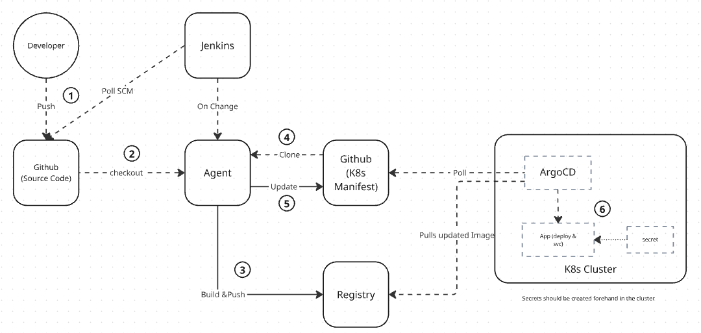
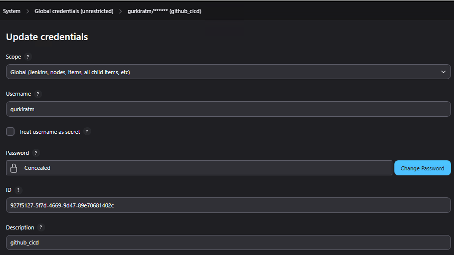

# ISE-User-Portal — CI/CD + GitOps Demo

## 🔎Overview

**ISE-Portal** is a demonstration project showcasing a complete CI/CD + GitOps workflow for a Python/Flask-based web application, deployed on Kubernetes using ArgoCD and built via Jenkins. 
It uses:

- A **[source code repository](https://github.com/gurkiratm/ISE_User_Portal.git)** to store the Flask application  
- A **[manifests repository](https://github.com/gurkiratm/cicd-ISE-manifests.git)** to store Kubernetes manifests 
- A **local Docker registry** to host built container images  
- A **Kubernetes cluster** (on-prem) with *Argo CD* for deployment

This setup demonstrates modern DevOps practices: **build → push → update manifests → GitOps sync → deploy**.

## 🧰 Tech Stack

  
  
  
  
  
  
  
  
  

---

## 📦 What’s Inside

### Repositories

| Repository | Description |
|-----------|-------------|
| [`ISE_User_Portal`](https://github.com/gurkiratm/ISE_User_Portal.git) | Flask source code, Dockerfile, and [Jenkinsfile](https://github.com/gurkiratm/ISE_User_Portal/blob/main/Jenkinsfile) for CI/CD |
| [`cicd-ISE-manifests`](https://github.com/gurkiratm/cicd-ISE-manifests.git) | Template manifests (Deployment/Service) and generated manifests managed by Jenkins + Argo CD |

---

## 🏗️ CI/CD → GitOps Flow (Jenkinsfile)

  

1. Developer pushes application code into the source repository  
2. Jenkins (polling or webhook) triggers the pipeline and checkout source  
3. Agent builds the Docker image and pushes it to the local registry  
4. Agent clones the manifests repo **via raw `git clone`** (to avoid multi-SCM polling)  
5. Agent updates the Deployment YAML with the new image tag and pushes the commit  
6. Argo CD detects the commit → syncs changes → deploys the updated version

> [!NOTE]
> All application-sensitive values are stored as **Kubernetes Secrets** (not committed to Git).

---

## ⚙️ Important Environment Variables (Jenkinsfile)

| Variable | Description |
|---------|-------------|
| `REGISTRY_URL` | Registry host:port (e.g., `10.88.19.170:5000`) |
| `IMAGE_NAME` | Docker image name (default: `ise_user_portal`) |
| `IMAGE_TAG` | Set to `${BUILD_NUMBER}` by Jenkins |
| `SOURCE_REPO` / `SOURCE_BRANCH` | Flask application repo & branch |
| `MANIFESTS_REPO` / `MANIFEST_BRANCH` | Manifests repo & branch |
| `MANIFESTS_REPO_PATH` | Repo without protocol — used for authenticated git clone & push |
| `DEPLOYMENT_FILE` | Final Deployment YAML path inside manifests repo |
| `CREDS_ID` | Jenkins credential ID (for git) |

Placeholders in manifest template:
- `__REGISTRY-URL__/__IMAGE-NAME__:__IMAGE-TAG__` — replaced by `${REGISTRY_URL}/${IMAGE_NAME}:${IMAGE_TAG}`

---

## 🛠️ Jenkins Configuration Notes

- 

    
📸 Create a GitHub credential (Username + PAT) in Jenkins and set ID = `CREDS_ID`

  
    
  

- Agent/node must have:
  - Docker (build + push)
  - Git (clone + commit + push)
  - Access to the local registry
- Pipeline uses the agent labeled `fedora`

> [!TIP]  
> Added `deleteDir()` at pipeline start to ensure clean workspace every run.

---

<h2>🐞 Issues Encountered During Setup (and Fixes)</h2>

 

Below is a detailed list of issues encountered while building the end-to-end CI/CD + GitOps pipeline, along with root causes and fixes.

| # | Issue | Root Cause | Fix |
|---|-------|------------|-----|
| **1** | Jenkins pipeline kept triggering in a loop | Jenkins had **two SCM sources** (source repo + manifests repo) | Removed Jenkins `git` step for manifests repo and replaced with raw `git clone` |
| **2** | Too many ReplicaSets created | Every image update produced a new history entry | Added `revisionHistoryLimit: 5` in Deployment |
| **3** | manifests-repo clone failed: directory exists | Jenkins workspace reused from previous build | Added `deleteDir()` or `rm -rf manifests-repo` before clone |
| **4** | Argo CD repo-server couldn’t reach GitHub | repo-server pod was on a worker node without internet | Added nodeSelector/toleration to force it on master |

<!-- 
| **3** | MetalLB LoadBalancer IP not reachable without port | LB assigns IP only — app was exposed on port **8000** | Used `LB_IP:PORT` format (`http://<IP>:8000`) |
| **6** | Local registry had hundreds of image tags | Jenkins tags images with `${BUILD_NUMBER}` every run | Plan to switch to Git commit hash + enabled registry GC |
| **7** | Git commit failed: identity unknown | Git user.name/email not configured in pipeline shell | Added `git config user.name` & `git config user.email` |
| **8** | ArgoCD DNS lookup error `server misbehaving` | repo-server running on worker node with **no internet** | Forced repo-server to run on master node |
| **9** | Kubernetes secret creation failed using env file | env file contained invalid key names (spaces) | Cleaned env file to valid format: `KEY=value` |

 -->

<!-- 
## Installing argoCD cli
curl -sSL -o argocd-linux-amd64 https://github.com/argoproj/argo-cd/releases/latest/download/argocd-linux-amd64
sudo install -m 555 argocd-linux-amd64 /usr/local/bin/argocd
rm argocd-linux-amd64

kubectl apply -f argocd-ise.yaml 
kubectl -n argocd get applications

 -->

